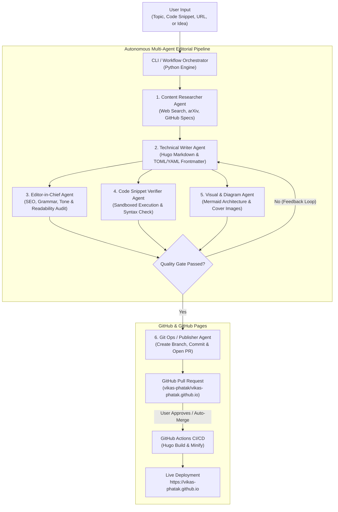

# Technical Proposal: Autonomous Agent-Driven Blog Workflow Management System
**Author / Repository Owner**: `vikas-phatak`  
**Target Platform**: GitHub Pages (`vikas-phatak.github.io`)  
**Core Framework**: Hugo (Static Site Generator) + Python Agent Orchestration Engine  
**Document Version**: 1.0.0  
**Date**: July 2026  

---

## 1. Executive Summary & Vision

Traditional personal blogging workflows suffer from high friction: drafting markdown, formatting frontmatter, verifying code snippets, optimizing for SEO, creating cover images, and executing Git deployment commands often take more time than writing the actual content.

This proposal outlines an **Autonomous Agent-Driven Workflow Management System** tailored for a technical dev blog hosted on **GitHub Pages** using **Hugo**. Powered by a modular **Python orchestration engine** and leveraging the Google Antigravity (AGY) agent ecosystem, this system transforms raw ideas, rough voice notes, code snippets, or academic papers into polished, verified, and SEO-optimized Hugo posts through an autonomous multi-agent editorial board.

---

## 2. End-to-End Architecture

The system is built on four core pillars:
1. **Content Repository (Hugo)**: Structured static site hosting themes, content markdown, assets, and layouts.
2. **Orchestration Engine (Python)**: A modular CLI and background worker built with Python (using `uv` and modern agent frameworks like LangGraph / Pydantic AI / AGY SDK).
3. **Multi-Agent Editorial Pipeline**: Specialized agents taking roles from ideation to code verification and git publishing.
4. **CI/CD Pipeline (GitHub Actions)**: Zero-touch deployment to GitHub Pages upon branch merge.

### 2.1 System Workflow Diagram



---

## 3. The Multi-Agent Editorial Board

The system simulates a professional tech publishing house. Each agent is responsible for a distinct phase of the content lifecycle.

| Agent Role | Responsibility | Primary Inputs | Primary Outputs |
| :--- | :--- | :--- | :--- |
| **1. Content Researcher** | Scours the web, GitHub repositories, and scientific literature to gather technical facts, documentation references, and benchmark data. | Topic prompt, arXiv URL, or library name. | Structured research brief with verified links and key takeaways. |
| **2. Technical Writer** | Synthesizes research into engaging, structured markdown. Embeds Hugo shortcodes, formats code blocks, and writes complete YAML/TOML frontmatter. | Research brief, author tone guidelines. | Draft markdown file (`content/posts/post-title/index.md`). |
| **3. Code Verifier** | Extracts fenced code blocks from draft tutorials and executes them in a temporary sandboxed environment to guarantee 100% bug-free tutorials. | Markdown draft containing code snippets. | Execution logs, pass/fail status, and syntax fix suggestions. |
| **4. Editor-in-Chief** | Enforces SEO best practices, keyword structure, Flesch-Kincaid readability, heading hierarchy (`h1`->`h3`), and prevents secret leaks. | Markdown draft + Verifier logs. | Editorial audit report + approved draft. |
| **5. Git Publisher** | Manages Git operations: creates clean feature branches, runs `hugo --buildDrafts` verification, commits changes, and opens a GitHub PR. | Approved markdown draft + assets. | GitHub Pull Request URL. |

---

## 4. Skills & Agents Inventory: Reuse vs. Develop

To maximize efficiency, we will leverage existing Antigravity skills and subagents where applicable, while developing targeted custom skills for Hugo and content syndication.

### 4.1 Existing Skills & Agents to Reuse

| Existing Skill / Subagent | Why & How It Will Be Used in the Blog Workflow |
| :--- | :--- |
| **`git-workflow-and-versioning`** | Enforces clean Git practices: creating isolated feature branches (`content/post-title`), meaningful commit messages, and PR management. |
| **`ci-cd-and-automation`** | Generates and maintains the `.github/workflows/deploy-hugo.yml` pipeline for automated GitHub Pages build and deployment. |
| **`code-reviewer` (Subagent)** | Re-purposed during the editorial review phase to audit technical tutorials included in the blog for architectural correctness and best practices. |
| **`security-auditor` (Subagent)** | Scans blog post drafts and frontmatter before committing to ensure no internal API keys, tokens, or private file paths are accidentally published. |
| **`mermaid`** | Automatically generates text-to-diagram Mermaid visualizations (flowcharts, architecture models) to embed directly inside technical blog posts. |
| **`literature-search-*`** | Leverages `openalex`, `arxiv`, and `pubmed` skills when writing deep-dive scientific or AI engineering posts that require academic citations. |
| **`idea-refine` & `interview-me`** | Activated via CLI when the user wants an interactive brainstorming session to flesh out blog post topics or stress-test an article outline. |
| **`managing-python-dependencies` & `uv`** | Enforces ultra-fast, isolated dependency management (`uv`) for the Python agent orchestration codebase. |

---

### 4.2 New Skills to Develop

| New Custom Skill Name | Target Directory | Description & Implementation Scope |
| :--- | :--- | :--- |
| **`hugo-content-master`** | `.gemini/skills/hugo-content-master/` | Enforces Hugo static site conventions: directory structures (`content/posts/`), shortcodes (``, ``), taxonomy indexing (tags/categories), page bundles, and TOML/YAML frontmatter validation. |
| **`blog-seo-auditor`** | `.gemini/skills/blog-seo-auditor/` | Audits blog drafts for SEO scoring: title tag lengths (50-60 chars), meta description impact, OpenGraph (OG) image presence, keyword density, and internal linking structures. |
| **`code-snippet-verifier`** | `.gemini/skills/code-snippet-verifier/` | Extracts fenced code blocks (`python`, `bash`, `js`, `yaml`) from draft markdown and executes them inside temporary sandboxed subprocesses or Docker containers to verify that code builds and runs cleanly. |
| **`social-syndication`** | `.gemini/skills/social-syndication/` | Automatically generates tailored promotional copy upon post approval: Twitter/X threads, LinkedIn professional announcements, and Markdown cross-posting payloads for Dev.to and Hashnode. |

---

### 4.3 New Custom Subagents to Develop

| New Subagent Name | Role Title | System Prompt & Capabilities |
| :--- | :--- | :--- |
| **`blog-editor-in-chief`** | Senior Tech Editor | Governs the tone, clarity, and narrative flow of the blog. Combines `blog-seo-auditor` and `security-auditor` skills to pass or reject drafts before git submission. |
| **`hugo-publisher`** | Git & Static Site Ops | Specialized worker that runs local Hugo server build checks (`hugo --buildDrafts --panicOnWarning`), manages Git branches, and interfaces with the `gh` CLI to open Pull Requests. |

---

## 5. System Directory Structure & Required Scripts

The blog repository (`vikas-phatak/vikas-phatak.github.io`) will house both the Hugo website and the Python agent workflow engine.

```text
vikas-phatak.github.io/
│
├── .github/
│   └── workflows/
│       └── deploy-hugo.yml              # GitHub Actions CI/CD for GitHub Pages
│
├── content/
│   └── posts/                           # Hugo Page Bundles (Markdown + Images)
│       └── welcome-to-agentic-blog/
│           ├── index.md
│           └── cover.png
│
├── themes/                              # Hugo Theme (e.g., PaperMod / Blowfish)
├── hugo.toml                            # Hugo Configuration
│
├── workflow/                            # Python Agent Orchestration Engine
│   ├── __init__.py
│   ├── orchestrator.py                  # Main CLI entrypoint (Typer / Click)
│   ├── config.py                        # System settings & LLM configuration
│   │
│   ├── agents/
│   │   ├── __init__.py
│   │   ├── base_agent.py                # Abstract Agent Class
│   │   ├── researcher.py                # Research Agent Logic
│   │   ├── writer.py                    # Technical Writer Agent Logic
│   │   ├── editor.py                    # Editor-in-Chief Logic
│   │   └── verifier.py                  # Code Snippet Execution Engine
│   │
│   ├── git_ops/
│   │   ├── __init__.py
│   │   └── publisher.py                 # Git checkout, branch, commit & PR automation
│   │
│   └── templates/
│       └── frontmatter_schema.toml      # Standardized Hugo Frontmatter Template
│
├── scripts/                             # Utility & Automation Scripts
│   ├── init_post.py                     # Quick script to bootstrap a clean post bundle
│   ├── verify_all_snippets.py           # Batch verifier for all historical blog posts
│   ├── local_preview.sh                 # Launches Hugo dev server with draft preview
│   └── setup_env.sh                     # Installs uv, Hugo CLI, and Python deps
│
├── pyproject.toml                       # Python Dependencies (managed via uv)
└── README.md
```

---

## 6. Detailed Specifications of Required Scripts

### 6.1 Main CLI Orchestrator (`workflow/orchestrator.py`)
* **Purpose**: Primary command-line interface for the blog owner (`vikas-phatak`).
* **Key Commands**:
  * `python -m workflow.orchestrator new --topic "Building Agents with LangGraph" --tags "AI,Python"`
  * `python -m workflow.orchestrator review --post-dir "content/posts/building-agents/"`
  * `python -m workflow.orchestrator publish --post-dir "content/posts/building-agents/" --auto-pr`
* **Implementation Logic**: Initializes the agent pipeline, streams status updates to the terminal, and handles user feedback loops if the editor agent requests revisions.

### 6.2 Code Snippet Verifier (`workflow/agents/verifier.py`)
* **Purpose**: Prevents "link rot" and broken code examples in tutorials.
* **Implementation Logic**:
  1. Uses regex / AST parsing to extract all fenced code blocks from markdown.
  2. Identifies language (`python`, `sh`, `js`, `json`).
  3. Writes snippet to a temporary scratch file in `<project>/scratch/`.
  4. Executes in a sandboxed subprocess (`python -c ...` or `node ...`) with a 10-second timeout.
  5. Captures `stdout` and `stderr`. If `stderr` contains traceback/errors, marks verification as **FAILED** and feeds errors back to the Writer Agent for auto-correction.

### 6.3 Git Publisher & PR Automator (`workflow/git_ops/publisher.py`)
* **Purpose**: Automates version control interactions using Git and GitHub CLI (`gh`).
* **Implementation Logic**:
  1. Verifies local Hugo build succeeds without errors or warnings: `hugo --minify --panicOnWarning`.
  2. Generates a slugified feature branch name: `post/building-agents-with-langgraph`.
  3. Stages the page bundle: `git add content/posts/building-agents/`.
  4. Commits with structured conventional commit syntax: `feat(content): publish post on Building Agents with LangGraph`.
  5. Pushes branch to origin and executes `gh pr create --title "..." --body "Automated PR generated by AGY Editorial Pipeline"`.

### 6.4 GitHub Pages CI/CD Pipeline (`.github/workflows/deploy-hugo.yml`)
* **Purpose**: Builds and deploys the Hugo site to GitHub Pages whenever a PR is merged into `main`.
* **Workflow Summary**:
  ```yaml
  name: Deploy Hugo site to Pages
  on:
    push:
      branches: [main]
    workflow_dispatch:
  permissions:
    contents: read
    pages: write
    id-token: write
  jobs:
    build:
      runs-on: ubuntu-latest
      steps:
        - uses: actions/checkout@v4
          with:
            submodules: recursive
        - name: Setup Hugo
          uses: peaceiris/actions-hugo@v3
          with:
            hugo-version: '0.128.0'
            extended: true
        - name: Build
          run: hugo --minify
        - name: Upload artifact
          uses: actions/upload-pages-artifact@v3
          with:
            path: ./public
    deploy:
      environment:
        name: github-pages
        url: ${{ steps.deployment.outputs.page_url }}
      runs-on: ubuntu-latest
      needs: build
      steps:
        - name: Deploy to GitHub Pages
          id: deployment
          uses: actions/deploy-pages@v4
  ```

---

## 7. Phased Roadmap & Implementation Plan

### Phase 1: Repository & Hugo Bootstrap (Week 1)
* [ ] Create GitHub repository `vikas-phatak/vikas-phatak.github.io` (or standalone project repo).
* [ ] Initialize Hugo site with a clean, modern dev theme (e.g., Blowfish or PaperMod).
* [ ] Configure `hugo.toml` with author metadata, GitHub links, and SEO defaults.
* [ ] Set up `.github/workflows/deploy-hugo.yml` and verify live GitHub Pages deployment.

### Phase 2: Core Orchestration Engine & Existing Skills (Week 2)
* [ ] Initialize Python environment using `uv` and configure `pyproject.toml`.
* [ ] Build `workflow/config.py` and `workflow/orchestrator.py` CLI skeleton.
* [ ] Integrate existing AGY skills (`git-workflow-and-versioning`, `mermaid`, `security-auditor`).
* [ ] Develop `scripts/init_post.py` and `workflow/git_ops/publisher.py`.

### Phase 3: Custom Hugo & Editorial Skills Development (Week 3)
* [ ] Write and test custom skill `hugo-content-master` for frontmatter and shortcode rules.
* [ ] Write and test custom skill `blog-seo-auditor` for readability and meta optimization.
* [ ] Develop `workflow/agents/writer.py` and `workflow/agents/editor.py`.

### Phase 4: Advanced Code Verification & Social Syndication (Week 4)
* [ ] Implement `workflow/agents/verifier.py` (sandboxed code block execution).
* [ ] Write custom skill `code-snippet-verifier` and batch script `scripts/verify_all_snippets.py`.
* [ ] Write custom skill `social-syndication` to auto-generate promotional social copy upon PR creation.
* [ ] End-to-end test of the entire workflow: from prompt CLI command to live production URL!

---

## 8. Summary of Benefits for `vikas-phatak`

1. **10x Publishing Velocity**: Focus 100% on architecture, ideas, and code while agents handle formatting, SEO, diagram generation, and Git plumbing.
2. **Guaranteed Code Quality**: Readers will never encounter broken code snippets or outdated syntax on your blog due to automated sandbox verification.
3. **Enterprise-Grade Version Control**: Every blog post goes through structured git branching, automated CI/CD builds, and PR peer reviews.
4. **Future-Proof & Extensible**: Built on Python and Antigravity skills, allowing you to plug in new LLMs, custom webhooks, or multi-platform cross-posting with ease.
